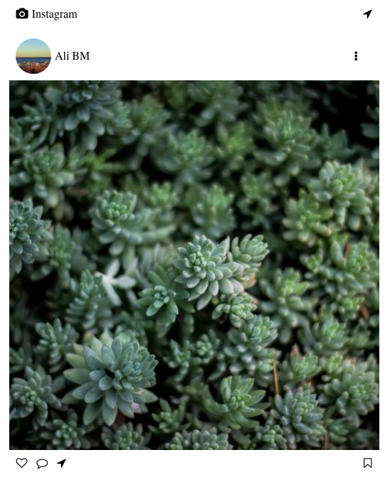

# Screen shots

# Installation

- Step 1: clone this repository.
- Step 2: change your directory to the project folder.
- Step 3: first run `npm install` in your terminal.
- Step 4: run `npm start` serve the application on your localhost.
- Step 5: open `localhost:3000` in your browser.
